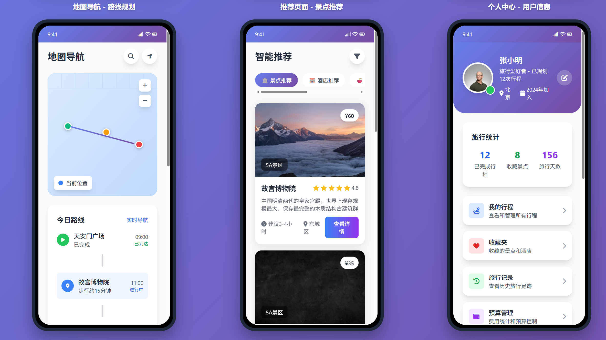
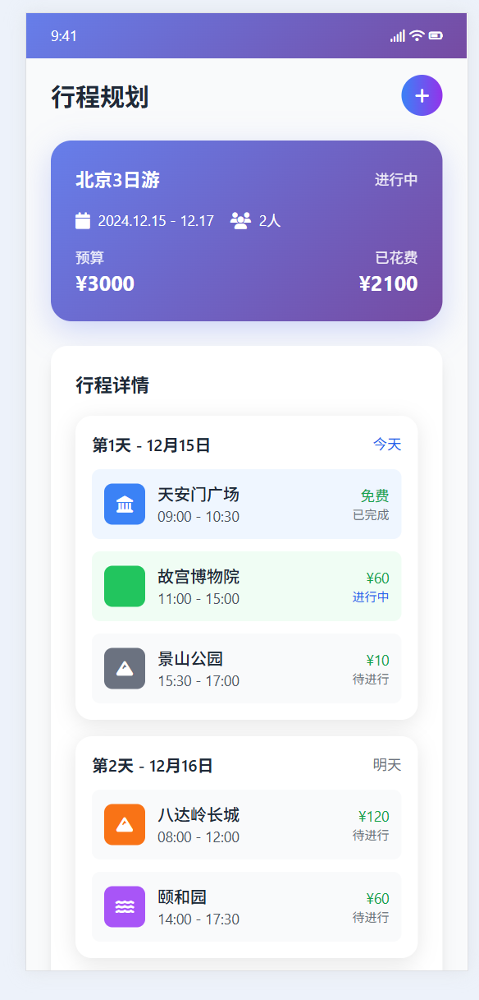

# 智能旅游Agent系统

## 🎬 演示 (Demo)

### 应用界面展示

#### 首页与快速入口


#### 智能推荐与地图导航


#### 设置与预算管理


#### 高级功能体验


#### 智能推荐界面


#### 预算管理详情


#### 费用记录与建议


#### AI对话助手


#### AI智能问答


#### 实时导航界面


#### 行程规划详情


#### 行程统计与预算


#### 个人中心界面


#### 个人中心功能


#### 智能推荐景点


#### 应用功能展示


---

## 📋 项目概述

智能旅游Agent是一个基于AI的综合性旅游规划助手，集成了自然语言处理、地图服务、推荐算法、预算管理等功能，为用户提供全方位的智能旅游规划服务。

### 🎯 核心特性

- 🤖 **AI智能对话**: 基于GPT-4的自然语言交互
- 🗺️ **智能路线规划**: 集成高德地图API的多点路线优化
- 🏨 **个性化推荐**: 基于用户偏好的景点、酒店推荐
- 💰 **预算管理**: 智能费用估算和预算分析
- 🌤️ **实时信息**: 天气、交通、路况等实时数据
- 📱 **响应式设计**: 支持PC、平板、手机多端访问
- 🔄 **多轮对话**: 上下文理解和连续对话支持

### 🏗️ 技术架构

```
前端层 (Vue.js + TypeScript)
    ↓
API网关 (Nginx + Express)
    ↓
业务逻辑层 (Node.js + AI引擎)
    ↓
数据层 (MongoDB + Redis)
```

## 📚 文档导航

### 1. [系统架构设计](01_系统架构设计.md)
- 整体架构设计
- 技术栈选择
- 核心模块设计
- 数据流设计
- 安全架构
- 性能优化
- 部署架构

### 2. [功能模块设计](02_功能模块设计.md)
- AI对话模块
- 路线规划模块
- 推荐系统模块
- 预算管理模块
- 详细代码实现

### 3. [数据库设计](03_数据库设计.md)
- MongoDB集合设计
- Redis缓存策略
- 索引优化
- 性能调优
- 数据备份

### 4. [部署实施指南](04_部署实施指南.md)
- 环境准备
- Docker部署
- 监控配置
- 运维管理
- 性能优化

## 🚀 快速开始

### 环境要求

- Node.js 18.x+
- MongoDB 5.0+
- Redis 6.x+
- Docker & Docker Compose

### 快速部署

```bash
# 1. 克隆项目
git clone https://github.com/your-username/travel-agent.git
cd travel-agent

# 2. 配置环境变量
cp .env.example .env
# 编辑 .env 文件，填入必要的API密钥

# 3. 使用Docker部署
docker-compose up -d

# 4. 访问系统
# 前端: http://localhost
# API: http://localhost/api
# 监控: http://localhost:3001 (Grafana)
```

### 开发环境

```bash
# 1. 安装依赖
npm install
cd backend && npm install

# 2. 启动开发服务器
npm run dev          # 前端
cd backend && npm run dev  # 后端

# 3. 启动数据库
docker-compose up mongo redis -d
```

## 🔧 配置说明

### 必需的环境变量

```env
# 数据库配置
MONGODB_URI=mongodb://localhost:27017/travel_agent
REDIS_URL=redis://localhost:6379

# API密钥
AMAP_KEY=your_amap_api_key
OPENAI_API_KEY=your_openai_api_key
WEATHER_API_KEY=your_weather_api_key

# JWT配置
JWT_SECRET=your_jwt_secret_key
JWT_EXPIRES_IN=7d
```

### 获取API密钥

1. **高德地图API**: [高德开放平台](https://lbs.amap.com/)
2. **OpenAI API**: [OpenAI平台](https://platform.openai.com/)
3. **天气API**: [和风天气](https://dev.qweather.com/)

## 📊 系统监控

### 监控指标

- **性能指标**: 响应时间、吞吐量、错误率
- **业务指标**: 用户活跃度、对话成功率、推荐准确率
- **系统指标**: CPU、内存、磁盘、网络使用率

### 监控工具

- **Prometheus**: 指标收集
- **Grafana**: 数据可视化
- **Sentry**: 错误监控

## 🔒 安全特性

- **HTTPS加密**: 全站SSL/TLS加密
- **JWT认证**: 无状态身份认证
- **API限流**: 防止恶意请求
- **数据加密**: 敏感信息加密存储
- **XSS防护**: 跨站脚本攻击防护
- **CSRF防护**: 跨站请求伪造防护

## 📈 性能优化

### 前端优化

- 代码分割和懒加载
- 图片压缩和CDN加速
- 缓存策略优化
- PWA离线支持

### 后端优化

- 数据库索引优化
- Redis缓存热点数据
- API响应压缩
- 异步处理耗时操作

## 🧪 测试策略

### 测试类型

- **单元测试**: Jest + Supertest
- **集成测试**: API接口测试
- **端到端测试**: Cypress
- **性能测试**: Artillery

### 测试覆盖率

```bash
# 运行测试
npm test

# 生成覆盖率报告
npm run test:coverage
```

## 📝 API文档

### 主要接口

- `POST /api/chat` - AI对话接口
- `POST /api/route` - 路线规划接口
- `POST /api/recommend` - 推荐接口
- `POST /api/budget` - 预算计算接口
- `GET /api/weather` - 天气查询接口

详细的API文档请参考 [API文档](docs/api.md)

## 🤝 贡献指南

### 开发流程

1. Fork 项目
2. 创建功能分支 (`git checkout -b feature/AmazingFeature`)
3. 提交更改 (`git commit -m 'Add some AmazingFeature'`)
4. 推送到分支 (`git push origin feature/AmazingFeature`)
5. 创建 Pull Request

### 代码规范

- 使用 TypeScript
- 遵循 ESLint 规则
- 编写单元测试
- 更新相关文档

## 📄 许可证

本项目采用 MIT 许可证 - 查看 [LICENSE](LICENSE) 文件了解详情

## 🆘 支持与帮助

### 常见问题

1. **系统无法启动**: 检查环境变量配置和端口占用
2. **API调用失败**: 验证API密钥是否正确
3. **数据库连接错误**: 确认MongoDB和Redis服务状态
4. **性能问题**: 查看监控面板和日志文件

### 获取帮助

- 📧 邮箱: support@travel-agent.com
- 💬 微信群: 扫描二维码加入
- 📖 文档: [完整文档](docs/)
- 🐛 问题反馈: [GitHub Issues](https://github.com/your-username/travel-agent/issues)

## 🗺️ 项目路线图

### 已完成 ✅

- [x] 基础架构设计
- [x] AI对话引擎
- [x] 路线规划功能
- [x] 推荐系统
- [x] 预算管理
- [x] 前端界面
- [x] 数据库设计
- [x] 部署方案

### 进行中 🔄

- [ ] 移动端APP开发
- [ ] 多语言支持
- [ ] 语音交互功能
- [ ] 社交分享功能

### 计划中 📋

- [ ] 虚拟现实导览
- [ ] 区块链积分系统
- [ ] 智能客服机器人
- [ ] 企业级定制版本

## 🙏 致谢

感谢以下开源项目和服务的支持：

- [Vue.js](https://vuejs.org/) - 前端框架
- [Node.js](https://nodejs.org/) - 后端运行环境
- [MongoDB](https://www.mongodb.com/) - 数据库
- [Redis](https://redis.io/) - 缓存数据库
- [OpenAI](https://openai.com/) - AI服务
- [高德地图](https://lbs.amap.com/) - 地图服务

---

**项目版本**: v1.0.0  
**最后更新**: 2024年12月  
**维护者**: 开发团队

⭐ 如果这个项目对您有帮助，请给我们一个星标！ 